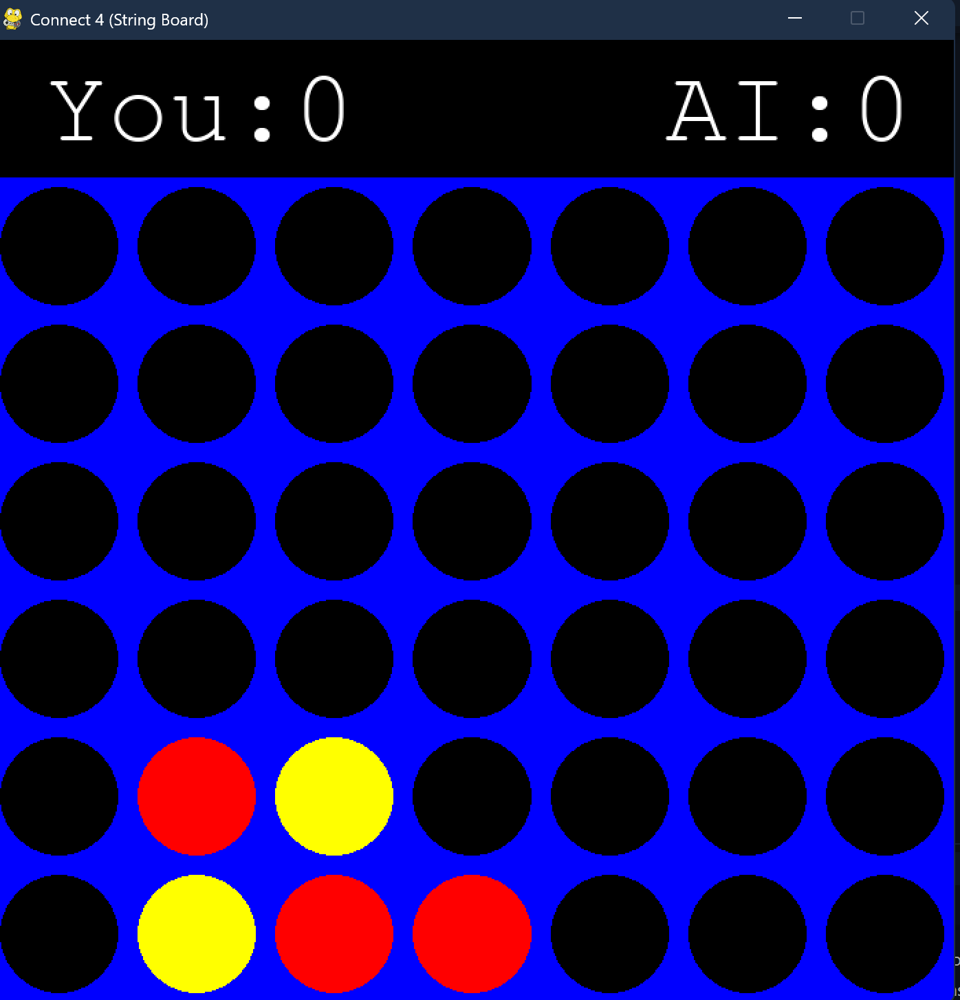

# 🧩 Connect 4 AI Game (with Tree Visualization)

A Python-based implementation of the classic **Connect 4** game with a graphical interface built using **Pygame**, and visual decision-tree rendering using **Tkinter**.

This project includes several AI strategies: **Minimax**, **Minimax with Alpha-Beta Pruning**, and **ExpectiMinimax**, allowing you to watch the AI decision-making process live.

---

## 🎮 Gameplay Screenshot



---

## 🚀 Features

- Two-player mode: Human vs AI
- Visual gameplay interface with Pygame
- Selectable AI algorithms:
  - Minimax
  - Alpha-Beta Pruning
  - ExpectiMinimax
- Adjustable search depth
- Decision tree visualization using Tkinter

---

## 🧠 AI Algorithms

- **Minimax**: Basic decision-making algorithm for zero-sum games.
- **Alpha-Beta Pruning**: Optimized version of minimax that skips irrelevant branches.
- **ExpectiMinimax**: Includes chance nodes to simulate randomness (e.g., shifting columns).

---

## ▶️ How to Run

1. Make sure Python is installed (Python 3.7+ recommended)
2. Install the required packages:

```bash
pip install -r requirements.txt
```

3. Run the game:

```bash
python main.py
```

---

## 📦 Requirements

- `pygame`
- `tk` *(standard with Python, but make sure it's available)*

---

## 📁 Project Structure

```
Connect4/
├── main.py       # Main game & AI logic
├── tree_visualizer.py     # Tree visualizer using Tkinter
├── requirements.txt
├── README.md
└── assets/
    └── gameplay.png       # Screenshot used in README
```


